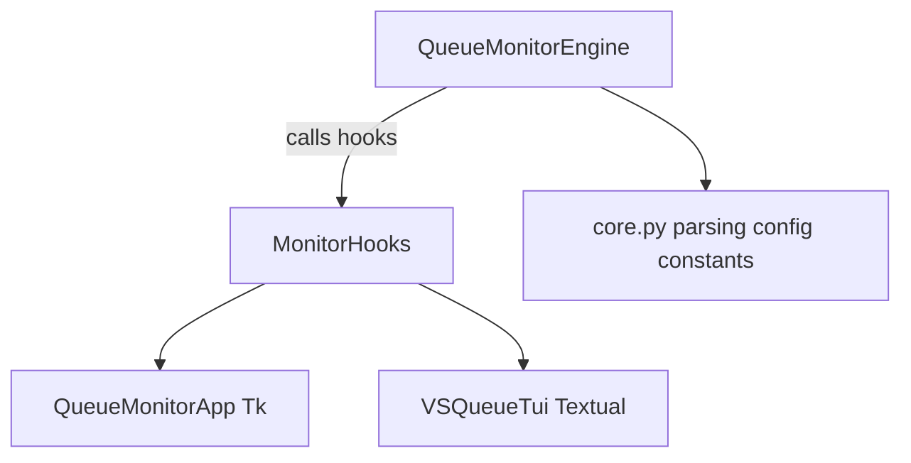

# VS Queue Monitor — GUI to TUI parity design

This document captures **reference behavior of the Tk GUI** and the **target behavior for the Textual TUI**, so both stay aligned without duplicating implementation detail in prose elsewhere.

## Scope and goals

- **Goal**: Match the Tk GUI’s **information architecture**, **graph semantics**, **alerts**, **settings persistence**, and **interaction patterns** in the terminal UI, while keeping the TUI **SSH-safe** (no Tk / no display).
- **Non-goals**: Pixel-perfect visuals; reproducing every Tk widget. The TUI uses braille cells, Rich markup, and modals instead of canvas and `Toplevel` windows.

## Architecture (shared vs UI)

- **Shared logic**: `vs_queue_monitor/engine.py` — `QueueMonitorEngine` — config, polling, queue parsing, progress, ETA, alerts, graph points (`graph_points`), and hooks into the UI.
- **Hooks**: `vs_queue_monitor/hooks.py`
  - `TkMonitorHooks`: `after` scheduling, Tk dialogs, history `Text`, graph redraw.
  - `HeadlessMonitorHooks`: Textual timers, `notify()` toasts, RichLog history, optional settings modal.

## GUI reference behavior (source of truth)

### Layout and panels

- **File**: `vs_queue_monitor/gui.py` — `_build_ui`.
- **Structure**: Vertical `PanedWindow` with three main vertical regions:
  1. **Queue graph** — `LabelFrame` titled “Queue graph”; KPI **summary** row above the canvas; plot area with Y-scale control (`Y → log` / linear).
  2. **Info** — Collapsible strip labeled **Info** (not “Status” in the UI), with details: Last change, Last threshold alert, Resolved log path, Global Rate.
  3. **History** — Collapsible strip labeled **History**, scrollable log.

- **Collapsing**: Chevron buttons and `_toggle_status_panel` / `_toggle_history_panel`; sash drag thresholds from `core.py` (`UI_STATUS_DRAG_AUTO_COLLAPSE_MAX_H`, `UI_HISTORY_DRAG_AUTO_COLLAPSE_MAX_H`).

### KPI row (summary)

- Headers: **POSITION**, **STATUS**, **RATE** (dynamic “Rolling N”), **WARNINGS**, **ELAPSED**, **EST. REMAINING**, **PROGRESS**.
- **Warnings** column: CSV thresholds from settings; each value grays out when position ≤ threshold or after that alert fired (`_refresh_warnings_kpi` in `engine.py`).

### Graph semantics (`redraw_graph`)

- **Step chart**: horizontal segments then vertical jumps (`smooth=False`).
- **Downsample** beyond `MAX_DRAW_POINTS` for drawing.
- **Y scale**: linear or log (`graph_log_scale_var`, `GRAPH_LOG_GAMMA` in `core.py`).
- **Y ticks**: step 5 within range, small values 1–5 when `vmin ≤ 5 ≤ vmax`, always `vmin` and `vmax`.
- **Horizontal grid** (`UI_GRAPH_GRID`): drawn only for **interior** Y ticks — `0 < idx < len(tick_vals) - 1`. If only two Y labels exist (typical narrow range, e.g. 101–103), **no** full-width horizontal grid lines appear.
- **X ticks**: “nice” intervals from a candidate list; format `%H:%M:%S` or `%H:%M` by span; deduplicate nearby ticks in pixel space; **vertical grid** at interior major tick times only (`0 < idx < len(tick_times) - 1`).
- **Minor x ticks**: short marks at minute-scale when span warrants.
- **Marker** at latest point; optional hover cursor and tooltip.
- **Live view** (`graph_live_view`, default on): X-axis `t1 = max(last sample time, now)` while monitoring so idle time after the last queue line is visible; GUI overlay button + Settings → Graph; TUI checkbox in Settings; same flag drives both.
- **Single-point span**: one sample uses `SINGLE_POINT_GRAPH_SPAN_SEC` centered on its time (GUI + TUI).
- **Help / copy / onboarding**: GUI — **? Help**, **Copy History**, **Copy graph (TSV)**, **F1**, first-run welcome; TUI — **F1** help modal, **c** / **v** clipboard (best-effort), welcome modal until OK (sets `tutorial_done`).
- **Log activity**: GUI label above the chart; TUI **LOG** line in the metrics block — derived from last log file growth vs `LOG_SILENCE_RECONNECT_SEC`.

### Alerts and popups

- **Threshold**: `show_threshold_popup(position, eta_display)` — Tk `Toplevel`; engine also logs.
- **Completion** (past queue): `show_completion_popup()`.
- **New queue** (interrupted mode): `ask_yes_no('New queue detected', …)`.

### Settings

- **File**: `open_settings` in `gui.py` — polling, thresholds, sounds, completion, graph (log scale, live view), “show every change”, reset defaults.
- **Persistence**: debounced `persist_config()` from `get_config_snapshot()`.

## TUI target spec

### Information architecture

- **Path row**: logs folder input (same semantics as GUI folder field).
- **KPI block**: same fields as the GUI summary row where feasible (POSITION, STATUS, RATE, WARNINGS, ELAPSED, EST. REMAINING, PROGRESS).
- **Queue graph**: braille step plot, time-based x resampling, min/max envelope per column when width-limited; grid and ticks aligned with **GUI rules** above (notably interior-only horizontal lines).
- **Info** panel: same labels as GUI Info — Last change, Last threshold alert, Resolved log path, Global Rate (Global Rate belongs here; rolling **RATE** stays in the KPI row).
- **History**: RichLog; collapsible default **collapsed** to give the graph vertical space (`h` / `l`).

### Keybindings (terminal)

- **Space**: play/stop monitoring.
- **o**: open Settings (same intent as GUI gear button).
- **F1**: Help (paths, config file, shortcuts).
- **c**: copy graph samples as TSV to the clipboard (best-effort).
- **v**: copy session log lines to the clipboard (best-effort).
- **h** / **l**: toggle History panel.
- **g** / **m** / **p**: toggle Graph, KPI metrics strip, Path row.
- **i**: toggle Info panel (when implemented).
- **q**: quit.

### Alerts and settings in headless mode

- **Toasts**: `notify()` for threshold, completion, errors; optional auto-accept toast for new-queue confirmation (TUI cannot block on a native yes/no dialog).
- **Settings**: modal with editable fields mirroring `get_config_snapshot()` keys where practical; **Save** writes `config.json` via `save_config(engine.get_config_snapshot())`.

### Documented gaps (optional follow-ups)

- **Hover**: GUI has canvas hover; TUI may add a keyboard “scrub” mode later.
- **Sash drag**: TUI uses toggles and resize instead of draggable sashes.
- **Exact pixel tick dedup**: TUI approximates `min_label_dx` in character columns.

## Files involved

| Area | Location |
|------|----------|
| Engine | `vs_queue_monitor/engine.py` |
| GUI | `vs_queue_monitor/gui.py` |
| TUI | `vs_queue_monitor/tui.py` |
| Hooks | `vs_queue_monitor/hooks.py` |
| Constants / palette | `vs_queue_monitor/core.py` |

## Acceptance checks

- Graph **step shape** matches GUI for the same `graph_points`.
- Log/linear Y toggle matches engine/GUI mapping.
- Collapsing **History** gives vertical space to the graph.
- **Interior-only** horizontal grid behavior matches narrow Y ranges (often no h-grid).
- **Info** vs **History** naming matches the GUI.
- **Settings** (`o`) opens a modal that can persist the same config keys as the GUI.
