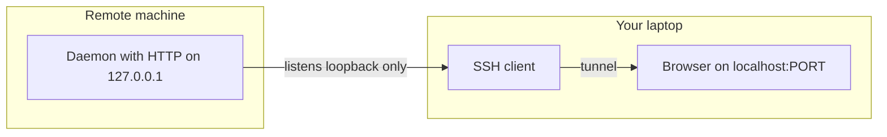

# Real-life examples: local web + SSH vs TUI + GUI

Reference catalog for **architecture discussions** (e.g. optional future **local HTTP + browser** for remote viewing, or **SSH** workflows). The **shipping** VS Queue Monitor is a **Python** Tk + Textual app; this doc does not describe its layout.

See [`DESIGN.md`](DESIGN.md) for product intent and [`README.md`](../README.md) for how to run the app.

---

## Pattern A: Local web UI + backend (often `127.0.0.1`)

These tools **start a small HTTP server** and you use a **browser** (or tunnel to your laptop’s browser).

| Example | What it does | Typical access |
|--------|----------------|----------------|
| **[Syncthing](https://docs.syncthing.net/users/guilisten.html)** | File sync; admin is a web UI | Default **`127.0.0.1:8384`** |
| **[TensorBoard](https://www.tensorflow.org/tensorboard/get_started)** | ML metrics/charts | **`http://localhost:6006`** |
| **`kubectl proxy`** ([Kubernetes docs](https://kubernetes.io/docs/reference/kubectl/generated/kubectl_proxy/)) | API/dashboard paths in browser | **`127.0.0.1:8001`** |
| **[Portainer](https://docs.portainer.io/)** | Container UI | Often tunneled: **`ssh -L 9443:localhost:9443`** |

**Takeaway:** Local process + localhost UI is common for admin tools. Remote access is often **SSH port forward**, not exposing ports publicly.

## Pattern B: SSH tunnel to a remote localhost service

- [DigitalOcean SSH port forwarding](https://www.digitalocean.com/community/tutorials/ssh-port-forwarding)
- [Baeldung — access web pages via SSH](https://www.baeldung.com/linux/ssh-tunnel-access-web-pages)

## Pattern C: TUI vs native GUI as separate products (example: Git)

| Style | Examples |
|--------|----------|
| **TUI** | [lazygit](https://lazygit.dev/), [tig](https://jonas.github.io/tig/) |
| **GUI** | [Fork](https://git-fork.com/), [GitKraken](https://www.gitkraken.com/) |

## Pattern D: Electron / embedded webview

Examples: VS Code, many chat apps — web tech inside a native shell; tradeoffs include bundle size and RAM.

## Pattern E: Terminal-only tools

**htop**, **btop** — no HTTP server; best when you live in SSH and want zero extra ports.

---

## Map to VS Queue Monitor

If you add a **local web dashboard** later, bind **`127.0.0.1`** and reuse the same **`vs_queue_monitor`** engine for tail + parse. For **remote** access, prefer **SSH `-L`** to that port. The **stock** app remains **Tk + Textual** only.
