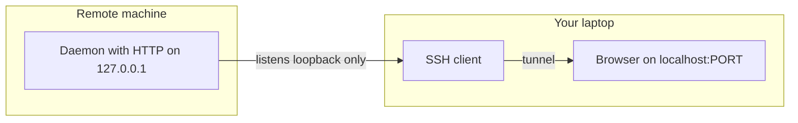

# Real-life examples: local web + SSH vs TUI + GUI

Reference catalog for architecture discussions: how common tools combine **local HTTP + browser** UIs (often with **SSH port forwarding** for remote access) versus **terminal/TUI** versus **native GUI**. Use it to compare options for VS Queue Monitor (e.g. a future local server + web UI vs terminal-only).

This document is **not** the product design contract; see [`DESIGN.md`](DESIGN.md) for web UX and journeys.

---

## Pattern A: Local web UI + backend (often `127.0.0.1`)

These tools **start a small HTTP server** and you use a **browser** (or tunnel to your laptop’s browser). This matches “run app locally, bind loopback, optionally SSH forward.”

| Example | What it does | Typical access |
|--------|----------------|----------------|
| **[Syncthing](https://docs.syncthing.net/users/guilisten.html)** | File sync; admin is a web UI | Default **`127.0.0.1:8384`**; docs describe changing listen address for LAN with auth/HTTPS |
| **[TensorBoard](https://www.tensorflow.org/tensorboard/get_started)** (TensorFlow) | ML metrics/charts | Default **`http://localhost:6006`** (`tensorboard --logdir ...`) |
| **[Jupyter / JupyterLab](https://jupyter-server-proxy.readthedocs.io/)** | Notebooks, proxies child apps | Local server; ecosystem often uses **127.0.0.1** and proxy patterns |
| **[Voilà](https://voila.readthedocs.io/)** | Turn notebooks into dashboards | Serves on **localhost** (e.g. port 8866) |
| **`kubectl proxy`** ([Kubernetes docs](https://kubernetes.io/docs/reference/kubectl/generated/kubectl_proxy/)) | Browser access to API/dashboard paths | Defaults to **`127.0.0.1:8001`** |
| **[Portainer](https://docs.portainer.io/)** (Docker) | Container management UI | Often on host:9443; **SSH `-L 9443:localhost:9443`** is a common way to reach it from your laptop ([typical tunneling writeups](https://selfhosting.sh/foundations/ssh-tunneling/)) |
| **Grafana / Prometheus** (ops) | Dashboards | Frequently **not** exposed publicly; accessed via **VPN or SSH tunnel** ([example writeup](https://igorstechnoclub.com/securing-grafana-and-prometheus-with-ssh-tunnels-instead-of-public-ports/)) |

**Takeaway:** “Local process + localhost web UI” is **mainstream** for admin, observability, and ML tooling. Remote access is **usually** SSH **local port forward** (`ssh -L local:remotehost:remoteport`), not opening the service to the internet.

## Pattern B: SSH tunnel to a remote localhost service (same as A, remote)

This is **not** a different product category—it is **how** Pattern A is used from another machine.

- General mechanics: [DigitalOcean SSH port forwarding](https://www.digitalocean.com/community/tutorials/ssh-port-forwarding), [Baeldung “access web pages via SSH”](https://www.baeldung.com/linux/ssh-tunnel-access-web-pages).
- Same idea as tunneling to **Portainer**, **internal Grafana**, **Jenkins**, etc., on a server that only listens on **localhost**.

## Pattern C: TUI + “GUI” as **separate products** in one problem space (Git)

Here the industry usually **does not** ship one binary with two full UIs from one vendor; you get **ecosystem choice**:

| Style | Examples |
|--------|----------|
| **Terminal / TUI** | [lazygit](https://lazygit.dev/), [tig](https://jonas.github.io/tig/), [gitui](https://github.com/extrawurst/gitui) |
| **Native desktop GUI** | [Fork](https://git-fork.com/), [GitKraken](https://www.gitkraken.com/), [Tower](https://www.git-tower.com/) (paid / commercial) |

**Takeaway:** **TUI vs GUI** often splits into **different tools**, not one shipped “TUI + GUI” from the same small team—unless the GUI is a **thin** wrapper (see D).

## Pattern D: One runtime, **web tech** for UI (Electron / embedded browser)

| Example | Notes |
|---------|--------|
| **VS Code** | Electron; [Remote - SSH](https://code.visualstudio.com/docs/remote/ssh) uses SSH to run the backend remotely and UI locally—related **remote** story, different from a simple log-tail agent on one machine |
| **Slack, Discord, many “desktop” apps** | Web UI in a native shell; tradeoff is size/RAM ([common discussion](https://dev.to/maniishbhusal/why-billion-dollar-companies-ship-electron-apps-and-why-developers-hate-them-3pd3)) |

**Takeaway:** “Packaging GUI as browser + backend” is **industry standard** at scale; smaller tools often use **system browser + localhost** instead of Electron to stay light.

## Pattern E: Terminal-first tools with **no** web UI (ops / live debug)

| Example | Role |
|---------|------|
| **htop**, **btop** | Live process view in SSH; no server |
| **`docker` CLI** | Primary surface; optional UIs (Portainer, Docker Desktop) are **separate** |

**Takeaway:** Pure TUI wins when the user is **always in SSH** and wants **zero** extra port or browser.

---

## Map to VS Queue Monitor

- **Closest analogues** to “local engine + **localhost** web + **SSH** for remote”: **Syncthing**, **TensorBoard**, **Jupyter**, **kubectl proxy**, **Portainer**/Grafana-style **tunnel** access.
- **Closest analogues** to “maintain both full TUI and full GUI”: the **Git** ecosystem—usually **two products**, unless you keep one surface **thin** (CLI flags + one web UI).

The **browser-only** build in this repo (File System Access API, no server) is a different constraint set; this catalog applies when evaluating a **local backend** or **alternate** clients.
